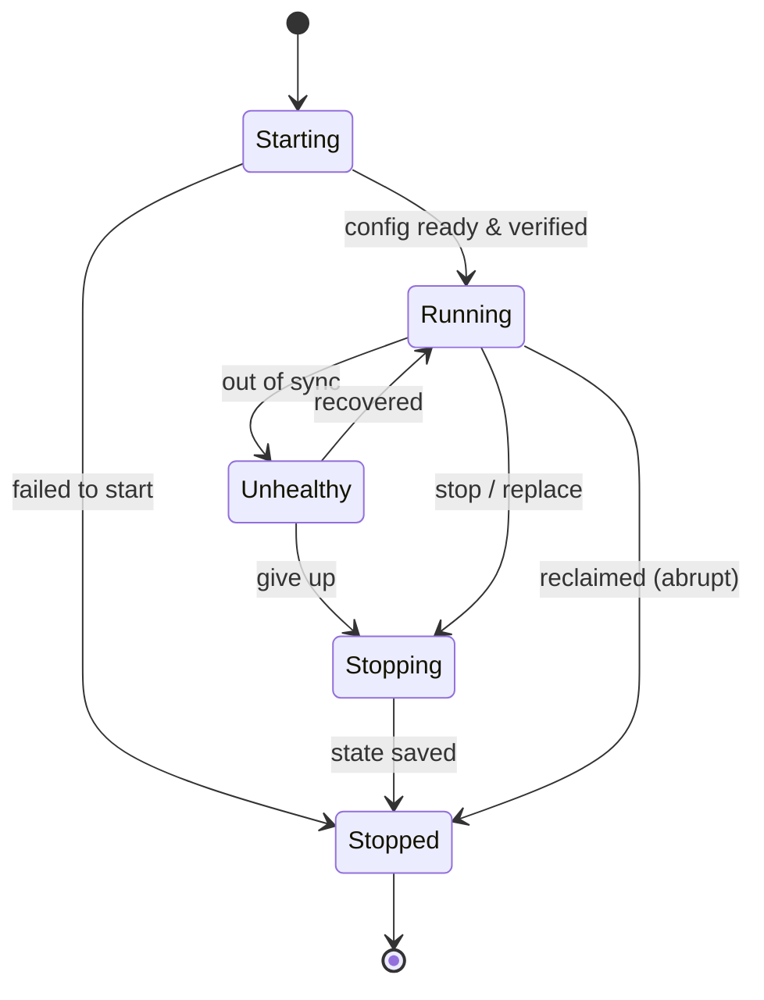

# Studio

Web UI for [openab](https://github.com/openabdev/openab) — start using openab
easily and control multiple fleets from one place.

Studio is the **director's console** for the openab control plane. Humans
direct; agents do the work. Studio is a thin front-end over the openab
operator core — it doesn't reinvent control, it surfaces it.

> **Status:** early / greenfield. Interfaces are still being defined.

## The model

**The human is the director. Agents do the control.**

You declare the desired state; agents converge to it. Studio is where you set
intent, approve sensitive actions, and watch what's happening.

## Agent lifecycle

Every agent is classified into one of **5 states** — simple enough to read at a
glance, and independent of the runtime underneath (ECS, k8s, GKE,
docker-compose, …).

| State | Meaning |
|-------|---------|
| **Starting** | The control plane provisions an authenticated config; the agent proves its identity before it can run. |
| **Running** | Config is in sync — right version, alive and authorized. Only Running agents do work. |
| **Unhealthy** | Out of sync (lost heartbeat / failed check). Fenced off; recovers or moves to Stopping. |
| **Stopping** | Flush state and hand off cleanly to the next instance, within a deadline. |
| **Stopped** | Terminated. Not resurrected — a replacement is a fresh instance. |

## License

[MIT](./LICENSE)
