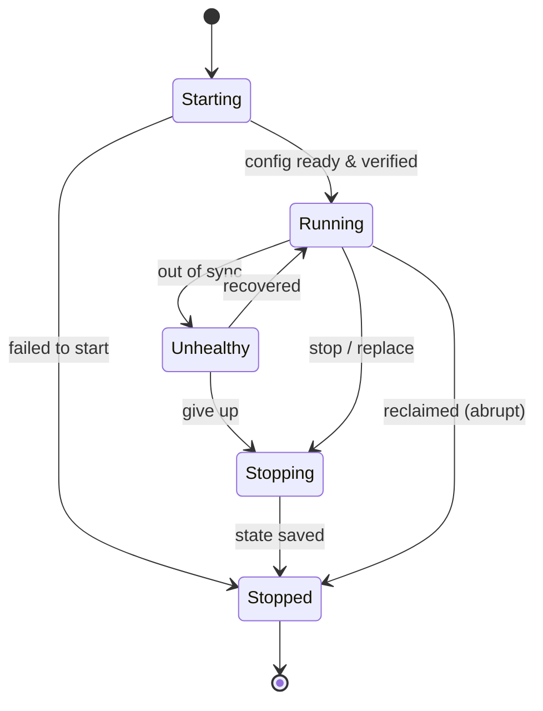

# ADR: Agent Lifecycle State Machine

- **Status:** Proposed
- **Date:** 2026-08-08
- **Author:** @brettchien
- **Reviewers:**
- **Tracking issues:** TBD

---

## 1. Context & Motivation

openab runs agents across different runtimes (ECS today; k8s / GKE /
docker-compose planned). We need one runtime-independent way to say "what state
is this agent in" that: any engineer reads at a glance; is identical regardless
of the runtime underneath; and is what the control plane observes and the
director acts on.

Humans direct; agents do the control. The control plane must classify every
agent, at any moment, into **exactly one** state.

## 2. Decision

Every agent is in exactly one of **5 states** (mutually exclusive, exhaustive).
The through-line is **configuration = identity + version + state**.

| State | Definition | The one thing that matters |
|---|---|---|
| **Starting** | Control plane provisions an authenticated config and injects it; the agent proves its identity before it runs. | Identity is bound and verified by the control plane — never self-asserted. |
| **Running** | Config in sync: right version, alive and authorized (heartbeat / lease). | Only Running agents do work; sync is verified, not self-reported. |
| **Unhealthy** | Out of sync (lost heartbeat / failed check / version not converged). | Fenced off at once; recover within a window or go to Stopping. |
| **Stopping** | Flush mutable state and hand off cleanly, within a deadline. | Persist before the deadline; reclaim skips this, so checkpoint while Running. |
| **Stopped** | Terminated. Not resurrected; a replacement is a fresh instance. | Record the cause (normal / crash / reclaimed) to decide replace vs investigate. |

## 3. Prior Art & Industry Research

| Project | How it handles agent lifecycle | Key decisions | What we take / differ |
|---|---|---|---|
| **Hermes Agent** (gateway) | 6 CLI states (run/start/stop/restart/status/install); Start→Running→Stop(SIGTERM→SIGKILL); systemd option; HMAC-signed lifecycle events to webhooks. | Process lifecycle via PID/systemd; **identity = `HERMES_HOME` path + process-name matching**; signed events for observability. | Confirms a small operational set works. But path/name identity is the weak self-report we reject → we require a **control-plane-issued, verified credential** (default-deny). We adopt **signed lifecycle events** for the observe/heartbeat channel. |
| **Pi** (`pi-agent-core`) | Conversation-level `idle ⇄ turn` phases; Turn Snapshot; `flushPendingWrites` between turns; Session tree + JSONL persistence. | Durable checkpoint **between turns**, not only at shutdown. | Their idle/turn = our Running sub-states (Idle/Busy). Validates **checkpoint while Running**; Stopping is best-effort. But it's turn-scope — we operate one layer up (instance → 5 states). |
| **Pi-Desktop** | Tauri shell over `pi --mode rpc` CLI (JSON-RPC/stdio); Tauri backend does CLI process management; session fork/resume; agent logic outside the shell. | Clean **shell/runtime split**; session lifecycle (fork/resume). | Validates **Studio = thin director front-end**, control lives in core. Process-management layer ≈ a runtime driver; fork/resume ≈ Stopping→next-instance via persisted state. |

> OpenClaw centers on a plugin gateway for message/session management across
> platforms; it has no formal instance-level lifecycle state machine, so Hermes
> and Pi are the directly relevant prior art.

## 4. Why This Approach

- **≤5, MECE** → one-glance comprehension; every agent maps to exactly one.
- **Sub-states are attributes, not states** (Idle/Busy; Provisioning/Hydrating/
  Booting; death cause) → keeps the set small.
- **Only Running does work** → scheduler and approval gate become a single
  predicate (`state == Running`).
- **Identity default-deny + continuous trust** (heartbeat/lease) → closes the
  gap every prior-art tool left open (path/name or no identity).
- **`reclaim` jump** models spot/preemption reality (skips Stopping).

## 5. Principles

1. **Default-deny trust:** identity is proven with a control-plane-issued
   credential, never accepted from the agent's own claim.
2. **Trust and sync are continuous, not one-shot** — hence heartbeat / lease.
3. **Only `Stopped` is terminal** (absorbing). Restart = a new lifecycle.
4. **`reclaim`** may jump from any live state straight to `Stopped`.
5. **Runtime-independent:** each driver projects native states onto these 5; the
   machine never changes per runtime.

## 6. Runtime Independence (projection)

Each runtime driver maps its native states onto the 5. "In sync" (Running) means
desired config equals observed — the reconcile loop has zero diff for this agent.

| canonical | ECS | k8s / GKE | docker-compose |
|---|---|---|---|
| Starting | PROVISIONING/PENDING | Pending/ContainerCreating | created/starting |
| Running | RUNNING + health OK | readinessProbe OK | healthy |
| Unhealthy | health check fail | probe fail / lease lost | healthcheck fail |
| Stopping | DEACTIVATING (stopTimeout) | Terminating (grace + preStop) | stopping (stop_grace_period) |
| Stopped | STOPPED (+reason) | deleted / preempted | exited |

## 7. Alternatives Considered

- **Adopt Hermes' 6 operational states verbatim** — rejected: mixes
  install/service concerns with runtime state and lacks a health/identity
  distinction.
- **Make the conversation turn loop (pi idle/turn) the primary machine** —
  rejected: that's a sub-layer of Running, not instance lifecycle.
- **K8s-style granular phases** (Pending/Running/Succeeded/Failed/Unknown +
  container states) — rejected: too many for one-glance; folded into attributes.
- **Drop `Unhealthy` (only Running/Stopped)** — rejected: loses the "alive but
  fenced-off" distinction the director relies on.

## 8. Consequences

- The read-model and Studio report **only these 5 states**.
- Every runtime driver must provide a **native→5-state projection**
  (conformance requirement).
- Detailed sub-states are attributes of the 5, not new states.
- **Follow-up:** a `RuntimeDriver` contract ADR defines the verbs
  (apply/observe/scale/…) that drive these transitions.

## 9. Validation

Docs-only ADR; mermaid renders on GitHub. No code changes.
