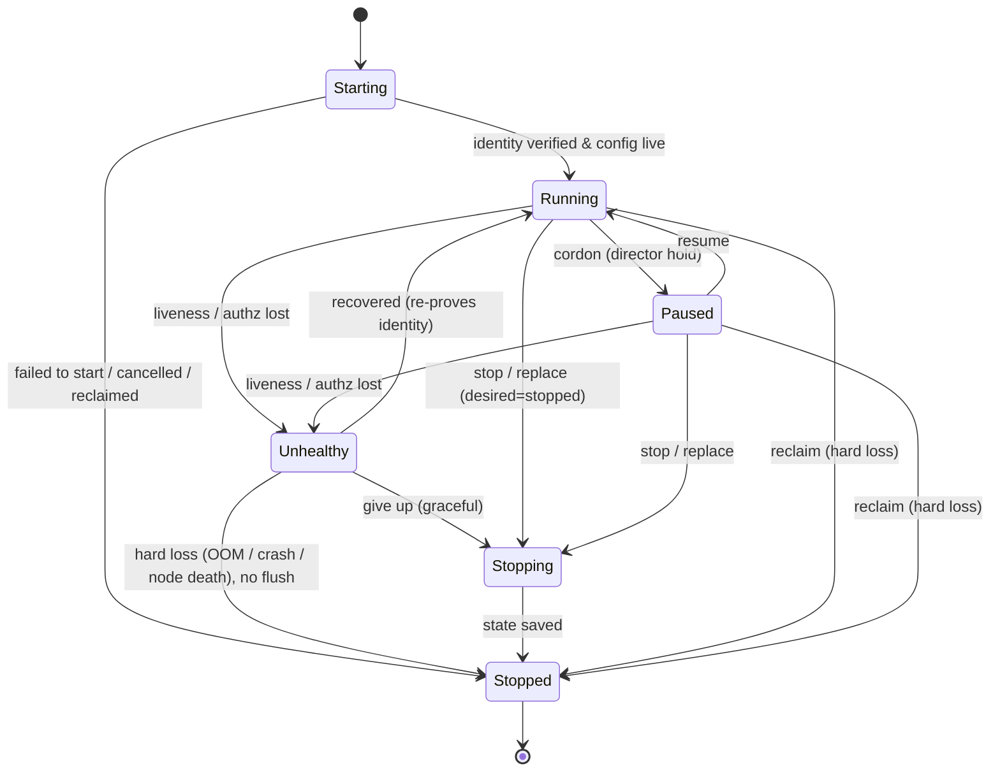

# ADR: Agent Lifecycle State Machine

- **Status:** Proposed
- **Date:** 2026-08-08
- **Author:** @brettchien
- **Reviewers:** Mira (ECS), Jellyfish (control-plane), Falcon (MCP)
- **Tracking issues:** TBD

> **Y-statement.** In the context of running agents across heterogeneous
> runtimes, facing the need for one glanceable, runtime-independent notion of
> "what state is this agent in", we decided a canonical **6-state** lifecycle
> discriminated by `(desiredStatus, accepting_work, health)`, to get a
> **single-field dispatch predicate** and a clean native→canonical projection,
> accepting a sixth state and a per-runtime projection/conformance burden.

---

## 1. Context & Problem

openab runs agents across different runtimes (ECS today; k8s / GKE /
docker-compose planned). We need one runtime-independent way to say "what state
is this agent in" that: any engineer reads at a glance; is identical regardless
of the runtime underneath; and is what the control plane observes and the
director acts on.

Humans direct; agents do the control. The control plane must classify every
agent, at any moment, into **exactly one** state.

## 2. Decision Drivers

- **One-glance comprehension** — a small, mutually-exclusive, exhaustive set.
- **Single-field dispatch** — "may this agent take new work?" should be one
  field, not a conjunction every caller must remember.
- **Runtime-independent, decidable projection** — each driver must map native
  signals onto the canonical set *without ambiguity*.
- **Honest about faults vs intent vs teardown** — health, admission policy, and
  terminate-intent are different axes and must not be conflated.

## 3. Decision

Every agent is in exactly one of **6 states**, discriminated by three
observable axes — `desiredStatus` (running / stopped), `accepting_work`
(bool), and `health` (in-sync & authorized / not):

| State | Discriminator | Definition | The one thing that matters |
|---|---|---|---|
| **Starting** | desired=running; identity not yet verified/live | CP provisions an authenticated config and injects it; the agent proves identity before it runs. | Identity is bound and verified by the control plane — never self-asserted. A **per-instance** credential is minted here. |
| **Running** | desired=running ∧ accepting_work ∧ healthy | Alive, authorized, in-sync, and admitting work. | **Only Running admits new work** → dispatch/gate is the single predicate `state == Running`. |
| **Paused** | desired=running ∧ ¬accepting_work ∧ healthy | Healthy and in-sync but deliberately not admitting (director cordon). | Intent, not fault. Resumable; still subject to health edges. Keeping it a peer state is what keeps the dispatch predicate single-field. |
| **Unhealthy** | desired=running ∧ ¬healthy | Alive but fenced: liveness/authz/probe/lease lost. **Not** version skew. | Fenced at once; recover within a window (re-prove identity) or go to Stopping. Split cause: *observed-bad* vs *unobservable* (node lost). |
| **Stopping** | desired=stopped; graceful window open | Terminate committed: flush state and finish in-flight work within a deadline (may still be health-OK). | `desiredStatus==stopped` is the cross-runtime discriminator. Durability was already secured while Running. |
| **Stopped** | terminal (absorbing) | Terminated. Not resurrected; a replacement is a fresh instance. | Record the cause (normative enum: normal / crash / reclaimed). Granularity is **instance-level**. |

**Attributes, not states** (read alongside the state): `accepting_work`
(Running vs Paused); `superseded` / version-skew (healthy; drives
drain→replace; stays Running); health `cause` = observed-bad vs unobservable;
death `cause` enum; turn-level busy/idle.

## 4. Principles

1. **Default-deny identity.** Identity is proven with a control-plane-issued
   credential, never accepted from the agent's own claim. The **trust root is
   the runtime's injection primitive** (IRSA / k8s projected SA token) that
   delegates a platform identity — state it explicitly. **Role identity ≠
   instance identity**: mint a **per-instance** credential at `Starting`.
2. **Trust & sync are continuous.** Heartbeat carries a CP-signed, short-TTL
   **lease token bound to the instance id** (task ARN / pod UID). A **monotonic
   fencing epoch** guards generations — the CP accepts only the highest epoch,
   defeating zombie/split-brain after a partition. Credentials are revoked on
   Stopping/Stopped; `Unhealthy→Running` must re-prove identity.
3. **Only `Stopped` is terminal (absorbing), at instance granularity.** A
   container restart within the same pod is the *same* instance, not a
   `Stopped→Starting` flap; restart = a new lifecycle only when a new instance
   is created.
4. **`reclaim` is two paths, not one.** A *planned* interruption (Spot/preempt
   notice — ECS ~120s SIGTERM, GKE ~30s + preStop) **compresses `Stopping`**
   into a short deadline. Only a *hard* loss (node death / SIGKILL / OOM) jumps
   straight to `Stopped`. Durability never relies on the Stopping window —
   **checkpoint while Running.**
5. **Runtime-independent.** Each driver projects native signals onto the 6 via
   the discriminators `(desiredStatus, accepting_work, health)`; the machine
   never changes per runtime.
6. **Two predicates, kept apart.** *Dispatch new work* = `state == Running`
   (single field). *Doing in-flight work* = `Running ∪ Stopping`(within
   deadline). Don't collapse them into one sentence.

## 5. Model: config vs observed

`Instance = Desired Spec (identity + version) + Observed State`. Desired and
observed are strictly separated; **state is observed, not part of the desired
config**. "In sync" (Running) means the reconcile loop has zero diff on the
desired spec. (This replaces the earlier `config = identity + version + state`,
which folded observed state into desired config and could never reconcile to
zero diff.)

## 6. Runtime Independence (projection)

Discriminators, not native strings. `desiredStatus==stopped` is one signal
across runtimes: **ECS `desiredStatus STOPPED` ⟺ k8s `deletionTimestamp!=null`
⟺ compose stop-requested** — that is what makes `Stopping` decidable rather than
an ECS-only coincidence.

| canonical | ECS | k8s / GKE | docker-compose |
|---|---|---|---|
| Starting | PROVISIONING / PENDING / **ACTIVATING** (ENI + secret inject) | Pending / ContainerCreating / startupProbe pending | created / starting |
| Running | RUNNING + health OK + desiredStatus RUNNING | Running + readinessProbe True + lease valid | healthy *(healthcheck required)* |
| Paused | RUNNING + health OK + app-level cordon (`accepting_work=false`) | Ready but cordoned (app-level) | running + app cordon |
| Unhealthy | RUNNING + healthStatus UNHEALTHY / lease lost *(attribute, not a task state)* | readiness/liveness fail; **Unknown (node lost) → Unhealthy(fenced) + epoch fence**; CrashLoopBackOff | healthcheck fail |
| Stopping | desiredStatus STOPPED *(DEACTIVATING only if in a target group / service-discovery; else RUNNING→STOPPING)* | deletionTimestamp != null (Terminating: preStop + grace) | stop requested (stop_grace_period) |
| Stopped | STOPPED + stopCode (enum) | deleted; *preempted* = the reclaim edge | exited |

**Driver conformance conditions**
- A driver must expose all three discriminators; if it cannot, it does not
  conform.
- **docker-compose requires a `healthcheck`** — without one it only sees
  running/exited and can never separate Running from Unhealthy.
- **docker-compose must set `restart: "no"`** and hand restart to the control
  plane; `restart: unless-stopped` auto-resurrects a crashed container, which
  contradicts "Stopped is terminal" and competes with reclaim/replace.

## 7. Considered Options

- **6 states with Paused as a peer state (chosen).** Uses the discriminators to
  define Paused rigorously; keeps dispatch single-field.
- **5 states, Paused/Draining as a `Running` attribute** (reviewers' converged
  proposal) — *rejected as the surface model* because it forces a two-field
  dispatch predicate (`Running && accepting_work`); every caller that forgets
  `&& accepting_work` silently mis-schedules a paused agent. **We adopt its
  `(desiredStatus, accepting_work)` machinery as Paused's definition.**
- **Hermes' 6 operational states verbatim** — rejected: mixes install/service
  concerns with runtime state; path/name identity is the self-report we reject.
- **pi `idle/turn` as the primary machine** — rejected: a sub-layer of Running.
- **K8s granular phases** (Pending/Running/Succeeded/Failed/Unknown + container
  states) — rejected for the surface set; folded into attributes.
- **Drop `Unhealthy`** — rejected: loses the "alive but fenced" distinction.

## 8. Prior Art

| Project | Model | What we take / differ |
|---|---|---|
| **Kubernetes** Pod lifecycle | Phase + Conditions + Probes (three-layer decoupling); `Unknown` on node loss | Direct ancestor; we take the phase/condition/probe split; `Unknown`→Unhealthy(fenced). |
| **HashiCorp Nomad** | alloc states pending/running/complete/failed/**lost**; driver preemption events | `lost`/`unknown` is exactly our *unobservable* Unhealthy case. |
| **Temporal / Cadence** | workflow/activity states + heartbeat **lease fencing** | Validates the fencing epoch on the heartbeat lease. |
| **Erlang/OTP supervisor** | child spec + crash exit reason + `one_for_one`; restart spawns a new child | Supports "restart = new lifecycle / fresh instance". |
| **AWS EC2 instance lifecycle** | pending/running/stopping/stopped/terminated | Near-identical shape; instance-level granularity. |
| **systemd unit** | active / **failed** / … as first-class | `failed` as a first-class fault state. |
| **Ray actor** | PENDING / ALIVE / RESTARTING / DEAD | Close 1:1; `RESTARTING` = our replace path. |
| **Hermes / Pi / Pi-Desktop** | ops CLI states / in-process turn engine / desktop shell | Adjacent code, not instance-level lifecycle. Pi validates **checkpoint-while-Running**. |

## 9. Consequences

- The read-model and Studio report **only these 6 states**.
- Every runtime driver must provide a **native→6 projection** via the
  discriminators (conformance requirement), including the compose healthcheck
  and `restart:"no"` conditions above.
- Detailed sub-states are **attributes** of the 6 (accepting_work, superseded,
  health-cause, death-cause enum, busy/idle), not new states.
- **Follow-ups:** a `RuntimeDriver` contract ADR (verbs apply / observe / scale
  / cordon / …); an identity / lease / epoch spec ADR.

## 10. More Information

Format follows **MADR** (markdown ADR: context → drivers → options → decision →
consequences) with a **Nygard** status/context/decision/consequences spine and a
**Y-statement** summary. See `docs/review-runbook.md` for the review rubric this
ADR was gated on.
